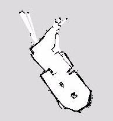
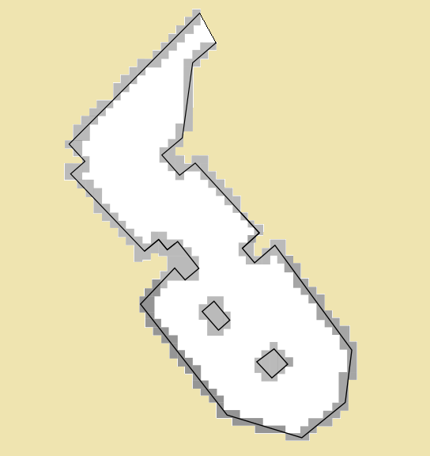

# Task description
The problem of this project was to create a solution which would allow a TurtleBot to explore a bordered space under specific circumstances. The problem was set as a bordered field in which there were a number of faces, rings and cylinders. The robot would explore the field, recognize the faces in it, find the rings and cylinders, and pick up the rings. It would talk with the people in order to infer information and perform specific tasks.

We used ROS and OpenCV for the solution to this problem. The robot scanned the field using the Kinect sensor and stored a map of it. We used the canny edge detector, and the k nearest neighbors algorithm provided by OpenCV, and vector transformations in order to approach objects on the field. We used the ViCos Lab face-detector for face detections. For the cylinder detection we used the Point cloud library and the RANSAC algorithm. We implemented the speech recognition using the Google recognition application. The general logic of our implementation can be split into two main parts: the search for faces, rings and cylinders, and the conversation with the people. We performed the integration of all these parts during runtime by calling specific scripts in a specific order. 

The ring and cylinder detection was implemented well and worked correctly. All the faces were detected and recognized correctly, and the logic of the solution worked well and made the correct conclusions. Altogether, the solution performed well to the task, with the minor exception of not always picking up all rings. 

# Methods
## The map
The map that we used all throughout the problem was created at the beginning by moving the robot around the field manually allowing for it to scan the field using the Kinect sensor. This was done a couple of times in order to ensure the most accurate result. The scanned map is shown bellow. On the basis of this map we later created the more polished map bellow.

## Ring detection
The robot would start its performance by detecting the rings on the field. It was our conclusion that it would be easier if we detected and collected every ring at the start, so later the robot would not have to go back in order to pick up the magical ring. We used OpenCV for this purpose, we subscribe to the topic $$/camera/rgb/image\_raw$$ in order to get all the pictures that the robot 'sees' in a form of geometry\_msgs::PoseStamped. With the help of OpenCV's $$cv\_bridge::CvImagePtr$$ we get a pointer to the image that comes from the robot's sensors. Then, we convert it to gray-scale and set the appropriate parameters to it (blur, contrast, brightness). We do this in order to have a clearer picture so that the algorithm can distinguish the rings (circles or ellipses) in the environment better and avoid false detections. The algorithm/transformation applied in order to find the circles is the $HoughCircles$ function from OpenCV. From this we get the pixels on the image where the center of the circle is detected. Here a problem arises when we need the exact location of the center on our map. Transforming the relative positions to coordinates in the map frame is not simple because it tends to detect them somewhere outside the map (because the center is not a point on the ring itself). It is worth mentioning the failure of the localizer, here. It was provided by the ViCos ROS Lab and maps the RGB image with the depth information of the Kinect sensor, which often failed to give us the right positions and often returned zeros. Another problem we faced, often, was that the data of the camera was too old, which again resulted in a failure of locating the detections. Regarding mapping the rings, as well as faces on the map, we filter them out by height.

## Approaching Objects on the Map
In the following section we describe how we calculate the transformation of the relative positions to coordinates given in the map frame. We used this calculation to approach detected faces, detected cylinders and to calculate an initial position for picking up a ring. The strategy for approaching objects can be split into to cases: when the object is located on a wall, and when the object is located on a box.

### Approaching Objects Located on a Wall
Initially, we get a point in the map frame close to a wall. Using the Canny edge detector, provided by OpenCV, from the map, which the TurtleBot uses to navigate, we obtain an array of pixels along the walls. Using a k nearest neighbor algorithm, also provided by OpenCV, we can find the closest points on the wall to the detected object. To account for imperfections within the map, e.g. walls not being perfectly straight, we consider the three closest points of the wall to the detected point and use the function $fitLine$ provided by OpenCV to get a 2D vector pointing along the wall. Generally it would have been possible to consider larger amounts of points along the wall, in order to have a better estimation of the wall orientation, but in cases of objects close to corners this would increase the risk of considering too many points belonging to a part of the wall with a different orientation than the one needed. After obtaining the orientation of the wall we still need to verify in which of the two possible directions the vector is pointing. This is done by turning the vector clockwise by 90 degrees which results in a normal vector to the wall's orientation. By adding the normal vector to one of the points on the wall and subtracting it once, we can see which of two resulting points is within the map and which is on the wall or outside the map. Therefore, we know if the normal vector is pointing inside the map or outside the map. Knowing the direction in which the normal vector is pointing tells us the direction in which the initial vector is pointing. By normalizing both vectors we can calculate any arbitrary position towards the given object with respect to the orientation of the wall. An illustrated example of the computation can be seen in Fig.~\ref{fig:1a}. In the cases of the faces and cylinders, the calculated goals are simply the initial position plus the normal vector pointing inside the map times approximately 15 cm. In the case of approaching the faces we can add an additional improvement to finding the orientation of the closest wall. We found out that sometimes the localization of the faces went wrong and the obtained position of the face was inside the wall rather then on the wall itself. In cases of straight walls this presented no problem for the calculation of the wall's orientation. 

### Approaching Objects Located on a Box
Contrary to the previous case, if the face was positioned on a box, there were 4 different orientated walls that were close by. This could easily result in the wrong part of the box being considered as the closest wall and therefore returned as a wrong orientation. To prevent such results we estimated that a face recognition would not be possible with an angle bigger then 45 degrees, when the normal of the face and the orientation of the robot were compared. In this case, we can assume that the wall closest to the robot, of all the walls close to the face, has to be the wall on which the face is situated. Therefore, we modified the calculation by first computing a bigger set of closest points to the estimated position of the face, e.g. 10 points. After this, we sort these points by the distance to the robot's current position. The closest of these points to the robot's current position is assumed to be on the right part of the wall. Taking the two closest points to the point on the wall, we compute the orientation of the wall again and proceed as before. The sort function of the C++ $std::vector$ class is used with an implementation of Euclidean distance for the given coordinates for sorting the points given by the k nearest neighbor computation. An illustrated example can be seen in Fig.~\ref{fig:1b}. The same assumption could unfortunately not be made for ring detections. As the rings have a 90 degree orientation towards the closest wall, the normal of the rings would point along this wall's orientation rather then being normal to it. Therefore the closest wall to the robot would definitely result in a false wall orientation.

## Picking up Rings
We faced two major issues when picking up the rings. First, due to the implementation of the detection of rings, using $HoughCircles$ given by OpenCV, we only detected rings if the angle between the robot's orientation and the normal of the circle was small. Second, within the localization of the detected rings on the map frame we lost many detections, as was mentioned in Section \ref{ringDetection}. Furthermore the localization of the rings was sometimes partly incorrect and therefore either within a wall or too far away from a wall. To account for all these uncertainties the following algorithm was implemented.

### Picking up Rings: The Algorithm

* Calculate an initial position of the robot using the first located position of the ring. Following the scheme presented in the previous section the closest point on the wall $\vec{P}_{Wall}$ is calculated as well as the normal of the wall $\vec{n}$, facing inside the map, and the orientation of the wall $\vec{v}$ which is the normal vector rotated by 90 degrees clockwise. All the direction vectors are normalized. The initial position $\vec{P}_{init}$ is then calculated by the following formula:
$\vec{P}_{init} = \vec{P}_{Wall} + 25cm \cdot \vec{n} - 50cm \cdot \vec{v}$.
Using this formula we made sure that we would always pick up the ring from the right side, given that $\vec{n}$ and $\vec{v}$ are calculated correctly. Furthermore the robot pose was orientated along vector $\vec{v}$.
* Try to re-detect the ring without localizing the detections on the map frame, to ensure that we do not loose any detections:

    * If the ring is re-detected, align the robot so that the x-coordinate of the ring center is within a certain interval by turning left or right, depending on whether the x-coordinate is larger or smaller then the given interval. After this, check if the next detection is within the interval and turn accordingly. Repeat this until the robot is aligned within the given interval. As the detections had small fluctuations within positioning the center of the circle we only considered averages of 10 detections.
    * If there are no detections within 5 seconds, move back for a short distance and wait again. Do this up to two times. If there are still no detections, take the initial pose of the robot for the approach of the ring.

* Move forward to pick up the ring and backwards afterwards to check if the ring is still there.
* Again, wait up to 5 seconds for detections of the ring. If there are none move back up to 2 times and wait each time again for 5 seconds. If there are any detections at all start the whole process again beginning at step 2. Else assume that the ring is picked up.

### Picking up Rings: The Setup
The prefactor of $\vec{n}$ was chosen to be 25 cm as the rings were approximately 15 cm away from the wall and the lance of the robot approximately 10 cm away of the center of the robot. The prefactor of $\vec{n}$ was chosen empirically, as the distance of 50 cm was sufficiently far, to have a high probability of the re-detection while not being too far, to create problems with imperfections in the odometry. If we managed to detect the ring after reaching the initial position we had a high success rate. If the ring was not picked up within the first try we would normally also re-detect the ring when checking if the pick up was not successful and we could pick the ring up in the second or third try. Despite this, in the second and third try the success rate of pickups became worse due to the alignment of the robot getting less accurate while moving back because we used the coordinates within the camera frame. Furthermore, the calculation of the initial position of the robot failed often, as the initial detection of the ring was located too far from its actual position and the wrong wall was chosen to calculate the initial position. If the ring was located close to the borders of the map, these wrongly calculated initial positions were often put outside the map. In such a case the program would return a failure to the logic, indicating the ring was not picked up.

## Face Detection and Recognition

We used the ViCos Lab face-detector for the face detection, which uses the DLIB\footnote{\url{http://dlib.net/} (last visited: 17.04.2018)} frontal face detector and returns a rectangle approximately marking the spot where the detected face should be. The resulting images, with sizes mostly between 80x80 pixels and 120x120 pixels, are reduced to 80x80 pixels sized images. If a detection results with a position of the face such that a 80x80 rectangle could not be fitted, the detection is omitted. The resulting 80x80 images were converted into a vector by putting the 80 pixels of the first row of the image in a vector and appending the next 80 pixels of the second row to the same vector and so forth. For each pixel the integer values of the RGB channels are stored, so that it represents the pixel in the i-th row and the j-th column with representing the different color channels, the first 4 vector entries are:
$v_1 = p_{1,1}(R), v_2 = p_{1,1}(G), v_3 = p_{1,1}(B), v_4 = p_{1,2}(R)$
Using a set of 190 images for each of the twelve people we got 22800 vectors of size 19200. Using Point cloud library (PCL)\footnote{\url{http://pointclouds.org/} (last visited: 17.04.2018)} \cite{pcl} we create a subspace $u_1$ which maximizes the variance of the projected input vectors. In a second step using Linear Discriminant Analysis (LDA) we create a subspace $\vec{w}_1$  which maximizes the distances between different classes. The eigenvectors of both subspaces are stored, as well as the mean of the input vectors creating the PCL subspaces $\vec{v}_{mean}$ and the mean of each class within the LDA subspace $\vec{m}_i$.

A new image can be recognized by reducing the image to the 80x80 pixel area in which the face is supposed to be and creating a vector $\vec{v}$ as described before. The resulting vector is first centered by subtracting the mean input vector $\vec{v}_c = \vec{v} - \vec{v}_{mean}$ and then projected onto the PCL subspace:
$a_i = \vec{v}_c\vec{u}_i^T$

The obtained vector is then projected on the LDA subspace:
$a_i^{LDA} = \vec{a}\vec{w}_i^T$.
Comparing the resulting vector $\vec{a}_i^{LDA}$ with the means $\vec{m}_i$ of the different classes, we find the closest class and assume that the input image belongs to this class. As we reduce the images to the part where the face is supposed to be, the recognition is depended on the positioning of the rectangle. This positioning gets less accurate with angle towards the normal of the face increasing or if the robot has a high angular velocity, e.g. is turning. A comparison between badly and well located faces is shown in Fig.~\ref{fig:3}.

To prevent wrong recognitions due to high angle towards the face normal, each face gets approached before a command is sent to recognize it. Furthermore, a set of 10 recognitions is considered and the face recognized the most times is chosen to be the correct recognition. However, the recognition from a constant position were in 90$\%$ of cases all equivalent. Therefore a robust calculation of the position to approach faces was critical for a reliable recognition of faces. A second issue was the changing illumination at different hours and days. An example of different illuminations can be seen in Fig.~\ref{fig:2}. Using images of different days and different times could somehow account for different illuminations, even though taking new pictures at the given time always increased the overall performance of the recognition. In the end we managed to get, with a constant set of pictures (which we did not change for different times or days), a recognition rate around 70$\%$.

## Cylinder Detection

The cylinder detection was implemented using the point cloud provided by the Kinect sensor of the robot and the PCL library. The point cloud given by the Kinect sensor is first reduced by a voxelgrid algorithm to points of size $1cm^3$. In the next step the point cloud is segmented looking for planar models by using the RANSAC algorithm. Found planar models, such as walls and the ground, are extracted from the point cloud. In the resulting point cloud we segment again using the RANSAC algorithm, looking for cylindric objects. The resulting points are scanned and sorted by their RGB values. If we have found enough points with a certain color, while there are not too many points with a second color we consider to have detected a cylinder. If there are points which do not have values which we consider to be red, green, blue or yellow, they are omitted. We got the best result by setting the lower threshold for the number of points with the correct color to be 10 points. If we detect a bigger amount of points with a second color we omit the detections. The threshold here was 5 points. The appropriate threshold for deciding whether a point was considered red, green, blue or yellow or if it has a different color and would therefore be omitted proved to be crucial for the amount of  found points. The best results we obtained with the intervals presented in Table \ref{table:1}.

The position of the cylinder was obtained by averaging all the x, y and z-coordinates of the obtained point on the cylinder. Even though this would not result in the center of the cylinder this approximation was accurate enough to approach the cylinder.

## Speech Recognition
For the speech recognition we used the Google recognition application\footnote{\url{https://cloud.google.com/speech/} (last visited: 17.04.2018)}. The $jsk\_common\_msgs$ ROS package is used in order to connect the master to the device where the application is installed. The messages are then sent to the $Tablet/voice$ topic in the form of $VoiceMessage$, arrays of strings that have been heard. After this, we check if any of the words that have been recognized is a word that is expected in the given stage of the program. If it is not, the robot simply asks for a repeat.

## The General Logic
The general logic of our implementation can be split into two main parts: the search for faces, rings and cylinders, and the interrogation of the people in order to determine the magical ring and the magical tower.

### Search for Objects
The search of the map was implemented in such a way that would allow for the robot to go around the map in sufficiently many steps, and sufficiently close to the walls so as to recognize faces, rings and cylinders. First, the map is segmented into a grid of squares roughly the size of the robot (the size was chosen so that we can use these squares as goals, and the robot can safely go there). The color of each square is determined from the colors of the pixels of which it consists. Gray for unknown, black for unavailable, and white for available. If all the pixels are white, then the square itself is white. If there is even one black or gray pixel then the square becomes black or gray. A drawing of the map, and how the grid would look is shown on Fig.~\ref{fig:4}.
When exploring the map, the robot would have to be in positions that would allow for it to detect faces, rings and cylinders. In order to achieve this, the exploration strategy would have to cover straight walls, as well as corners, and pillars. We analyzed the grid shown above, and came to the conclusion that there is a relatively finite number of shapes that appear in corners, straight walls, sole standing boxes, and pillars. The 10 shapes we found and used are shown on Fig.~\ref{fig:5}.
After finding the shapes, we analyzed the shapes on the map in order to determine where we would like the robot to stop and spin in regard with walls and corners. Having done this, for every shape we determined on which square, in regard to the shape, it would spin (the robot would spin in order to achieve greater coverage, as it normally looks in one direction when moving). This strategy produced a large number of goals, which should ensure that the robot moves in such a way that it would find all the items on the field. However, many of these goals were very close to each other, mainly because multiple shapes were close to each other. In order to avoid this, we determined a least distance which should be between two goals. This however, would allow for a situation in which a less critical goal (a goal originating from a straight wall next to a corner) is chosen over a more critical goal (the goal originating from the corner itself which would allow for the corner to be visited). In order to avoid this, we grouped the goals into three categories of importance. The chosen goal would always have the category with highest importance of all the goals in the given radius. This process creates a list of goals the robot would have to reach. These goals use the coordinate frame of the map, and need to be transformed. In order to do this we used tf\footnote{\url{http://wiki.ros.org/tf} (last visited: 17.04.2018)}. We transform the message into a $MoveBaseGoal$, and use a $MoveBaseClient$ to send it. We gain access to the map by subscribing to the "map" topic. We use the matrix that is published to create a new map that gives us the representation of the real field as a matrix that could be analyzed as a grid.

## Integration
The interrogation begins by finding a male person on the field. Once he has been found, the robot will approach him, and ask him, by listing the women one by one, whether they are lying, until one that is telling the truth has been found. Once this is completed, the robot goes to the woman and asks her who knows where the magical ring should be taken, and which the magical ring is. Because there is a limit on the number of questions that can be asked at once, the robot will go to another person on the field once the limit is reached, say "Hello [person's name]", and come back to the current position if more questions need to be asked. Once we have found which the people are who know which the magical ring and the magical tower are we have 3 cases:
\begin{itemize}
\item both are female
\item one is female, and one is male
\item both are male
\end{itemize}
In the first case, we do not know whether any of the women are lying. In order to determine this, we go to a man on the field and ask whether each of them is lying. After this we begin the routine for finding out the ring and tower by either asking directly (if they are not lying), or by asking yes and no questions (if they are). In the second case, we first visit the man, determine which ring/tower is magical, by asking yes and no questions, and then ask him if the woman is lying. We can then go to her and determine the other magical item. In the last case, we just ask the men yes and no questions, until we have determined which the magical items are. Once we have done that, we can just go to the magical tower, as we have already picked up the rings at the beginning.

## Performance Analysis
The results of the solution are as follows. The approach to the detected rings was not successful, and as a result not all rings were picked up. However, the ring and cylinder detection was implemented well and worked correctly. All the faces were detected and recognized correctly, and the logic of the solution worked well and found the correct ring and cylinder. Altogether, the solution performed well to the task, with the minor exception of not always picking up all rings, and thus sometimes failing to pick up the needed ring.

